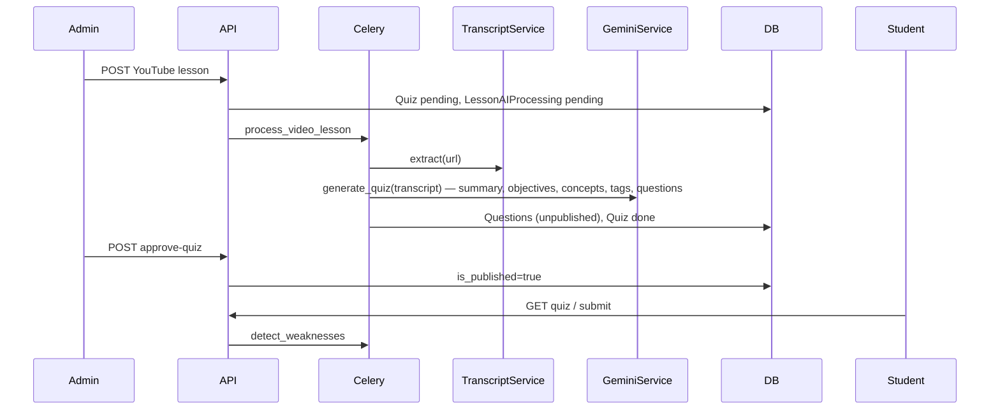

# AI Quiz Generation (YouTube + Gemini)

## Ownership

| App | Responsibility |
|-----|----------------|
| `courses` | Detect YouTube lesson → bootstrap → enqueue `process_video_lesson` |
| `ai_engine` | Transcript, Gemini, validation, persistence, admin preview/approve |
| `quizzes` | Store `Quiz` / `Question`; student fetch/submit only |

Gemini API calls live only in `ai_engine/services/gemini_service.py`.  
`quiz_generator.py` holds validation helpers only (no API).  
Legacy `gemini_analyzer.py` and `AIQuizGenerator` were removed in Phase 4.

## Architecture



## Environment

```env
GEMINI_API_KEY=your_key
GEMINI_MODEL=gemini-3.5-flash
CELERY_BROKER_URL=redis://localhost:6379/0
```

## Admin API

| Method | Path | Description |
|--------|------|-------------|
| GET | `/api/admin/courses/:courseId/lessons/:lessonId/processing-status/` | AI + quiz status |
| GET | `/api/admin/courses/:courseId/lessons/:lessonId/quiz-preview/` | All generated questions |
| POST | `/api/admin/courses/:courseId/lessons/:lessonId/regenerate-quiz/` | Re-run pipeline |
| POST | `/api/admin/courses/:courseId/lessons/:lessonId/approve-quiz/` | Publish questions |

## Student API

- `GET /api/student/lessons/:id/` — adds `quiz_generation_status`, `ai_processing_status`, `quiz_available`
- `GET /api/lessons/:id/quiz/` — published questions only
- `POST /api/quizzes/:id/submit/` — response includes `explanations[]`
