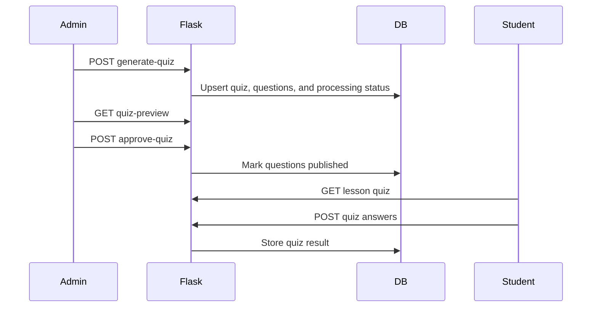

# AI Quiz Generation

## Ownership

The live backend is Flask. Quiz generation, preview, approval, student quiz fetch, and quiz submission are implemented in `backend/flask_app.py`.

The Flask backend stores data in the existing compatibility tables:

| Table | Responsibility |
| --- | --- |
| `courses_lesson` | Lesson source, content, transcript, and topic metadata |
| `ai_engine_lessonaiprocessing` | Processing status and extracted lesson summary metadata |
| `quizzes_quiz` | One quiz per lesson, passing score, and generation status |
| `quizzes_question` | Generated questions and publish state |
| `quizzes_quizresult` | Student quiz attempts and scores |

## Flow

## Admin API

| Method | Path | Description |
| --- | --- | --- |
| GET | `/api/admin/courses/:courseId/lessons/:lessonId/processing-status/` | AI and quiz status |
| GET | `/api/admin/courses/:courseId/lessons/:lessonId/quiz-preview/` | Generated questions |
| POST | `/api/admin/courses/:courseId/lessons/:lessonId/generate-quiz/` | Generate quiz questions |
| POST | `/api/admin/courses/:courseId/lessons/:lessonId/regenerate-quiz/` | Regenerate quiz questions |
| POST | `/api/admin/courses/:courseId/lessons/:lessonId/approve-quiz/` | Publish questions |

## Student API

- `GET /api/student/lessons/:id/` adds `quiz_generation_status`, `ai_processing_status`, and `quiz_available`.
- `GET /api/lessons/:id/quiz/` returns published questions.
- `POST /api/quizzes/:id/submit/` stores a quiz result and returns score details.
